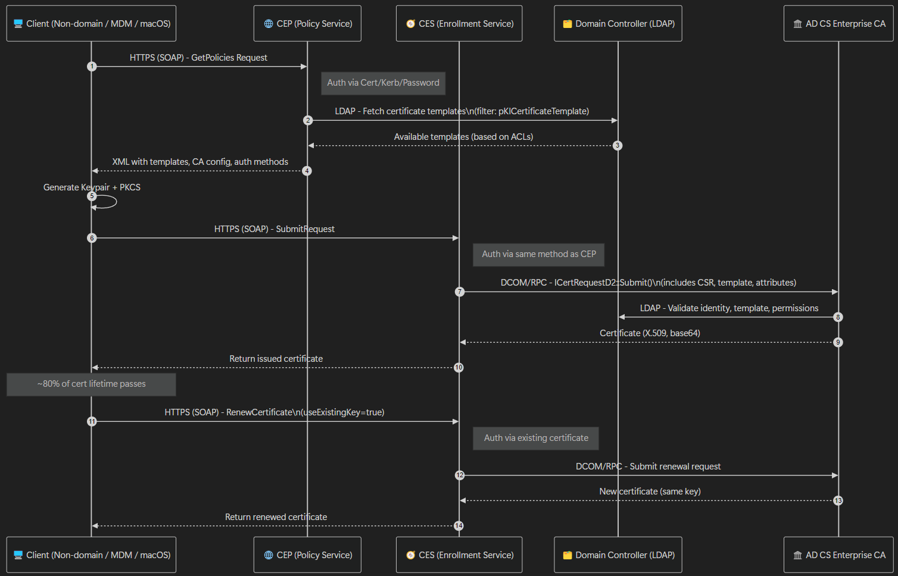

# Introduction

This document provides an in-depth description into the processes behind the Certificate Enrolment Web Service (CES) and Certificate Enrolment Policy Web Service (CEP) services within Active Directory Certificate Services (ADCS).

# High-Level Overview

At a very high level, CESCEP provides functionality for non-domain joined and / or non-windows devices to receive certificates from an ADCS Certificate Authority (CA).

CES and CEP are designed to work together to enable certificate enrolment.

- CEP provides certificate policy information (e.g. available templates and CAs)
- CES handles the certificate request submission and issuance process

CES/CEP is critical for scenarios involving non-domain-joined devices (e.g., mobile devices managed via MDM, macOS, Linux, or IoT devices), external partners, or clients in a DMZ, enabling secure certificate enrolment over the internet without exposing the CA directly.

The diagram below shows the CES CEP workflow in action.

# Typical Certificate Request Process

In order to understand CESCEP, it is important to understand how a regular certificate request works behind the scenes within an Active Directory (AD) environment. This section aims to provide detail to this effect.

## Query Active Directory with LDAP

First off, the client (who is requesting the certificate) uses the Lightweight Directory Access Protocol (LDAP) to establish a connection to the Domain Controller (DC). The following information is then queried by the client, against the DC:

- All `pKICertificateTemplate` objects. This refers to all of the available certificate templates within the current AD forest.
- All `pKIEnrollmentService` objects. This refers to enterprise CAs within the current AD forest that offer the certificate templates to be requested, as well as on which computer in the network the CA is running.
- All `msPKI-Enterprise-Oid` objects. This refers to unique, enterprise-wide object identifiers (OIDs) for custom certificate templates and application policies.

In summary, the `pKICertificateTemplate` and `msPKI-Enterprise-Oid` objects can be used to determine whether the client requesting a certificate is authorised to request a certificate of the desired type, and whether an automatic request is to be made. This is controlled by the `Enroll` and `Autoenroll` certificate template permissions respectively.

All of this information is stored in AD, and can be retrieved by browsing the Configuration partition of the AD forest.

<aside>
❗

You can find this information by logging onto the DC, opening the run menu, typing `adsiedit.msc`, and navigating to the Configuration partition.

</aside>

## Connection to the Certification Authority via RPC and DCOM

In the second step, a key pair and certificate request are generated on the client’s computer. These are generated based on the requested information, and then sent to the responsible CA. The protocol used to send this certificate request to the CA is called Windows Client Certificate Enrolment Protocol (MS-WCCE).

In the case where more than one CA offer the same certificate template, the decision is made at random as to which CA to send the certificate request to, assuming no site awareness has been configured. The CA is able to identify the requesting user based on Kerberos authentication.

## Certificate Request Submission and Processing

Once the client has generated the key pair and certificate request, the request is submitted to the CA via the MS-WCCE protocol, which uses Remote Procedure Call (RPC) and Distributed Component Object Model (DCOM) under the bonnet. The CA then processes the request as detailed in the steps below:

1. Verification of permissions: The CA checks the `pKICertificateTemplate` object to verify that the requesting user or computer has the necessary permissions (`Enroll` and/or `AutoEnroll`) to request the certificate. This is determined by the security descriptor on the certificate template in AD.
2. Validation of request: The CA validates the certificate request against the template’s requirements, such as key length, cryptographic algorithms, and application policies defined in the `msPKI-Enterprise-Oid` objects.
3. Certificate Issuance or Denial: If the request meets all of the criteria, the CA generates and signs the certificate using its private key. If however, the request is invalid or the user lacks permissions, the CA denies the request, and an error is returned to the client.

The CA may also apply additional policies, such as requiring manual approval for certain certificate types (e.g. subordinate CAs), depending on the certificate template configuration.

## Certificate Retrieval and Installation

After the CA processes the certificate request, the client retrieves the issued certificate (or an error message) via MS-WCCE. The client then:

1. Installs the certificate in the appropriate certificate store
2. Associates the certificate with the private key generated earlier, which is securely stored on the client’s system
3. If configured, the client may publish the certificate to AD (e.g. in the user’s `userCertificate` attribute) for use in services such as email encryption or authentication.

<aside>
❗

To view issued certificates, use the Certificate Management Console (`certmgr.msc`).

</aside>

## Automatic Enrolment (Optional)

For certificate templates configured with `Autoenroll` permissions, the client’s Group Policy settings can be configured to trigger automatic certificate requests during policy refresh. The client queries AD, identifies templates with `Autoenroll` permissions, and submit requests to the CA without the need for user intervention. 

## Error Handling and Logging

If the certificate request fails, the CA logs the event in its event log, and the client may receive an error code via MS-WCCE. As with any Microsoft product, the error codes are often cryptic and unhelpful. Common issues can include:

- Insufficient permissions on the certificate template
- Misconfigure template settings (e.g. unsupported cryptographic algorithms)
- Network connectivity issues with the client and the CA

Administrators are able to troubleshoot using Event Viewer on the CA or the client machine, or by enabling detailed logging on the CA by using the `certutil -setreg policy\EnableRequestExtensionList` command.

<aside>
❗

To enable detailed CA logging, run `certutil -setreg policy\EditFlags +EDITF_ENABLED_DEFAULTLOG` on the CA server and restart the CA service.

</aside>

## Summary

In summary, the classic Certificate Enrolment process consists of two main steps:

1. Query AD via the LDAP protocol for information relevant to Certificate Enrolment (certificate templates, and which CAs offer them)
2. Sending the certificate request via RPC/DCOM to the determined responsible CA.

However, this method can have disadvantages:

- It only works in the internal network, and requires the client to be domain-joined.
- Membership in the same AD structure, or a trust relation (including data replication) is required
- RPC/DCOM network ports must be exposed to all requestors.
- Authentication at the CA must be done via Kerberos

In practice, the main issue arises when trying to request a certificate on a computer which cannot directly contact the CA. The “workaround” process would be to manually create a certificate request, and copy it to the CA using removable media or a file share, and then submit and return the certificate through the same impex method.

# CESCEP Certificate Request Process

With an overview of a typical ADCS setup for certificate requests, it is now much easier to see the differences and the advantages that CESCEP can bring.

With the typical enrolment process, certificates are requested via the LDAP protocol and RPC / DCOM. This requires clients to be domain-joined, and connect to the RPC / DCOM ports on the internal network.

## Introductory Information

The Certificate Enrolment Web Services, consisting of CES and CEP, allow application to be submitted via an HTTPS interface, essentially acting as a proxy between the client and the CA. There are two protocol involved with the CESCEP services, namely MS-XCEP, and MS-WSTEP. Some basic information about these protocols is provides in the following section

The use of CESCEP offers the following advantages:

- Client are able to apply for new certificates via the internet, without the CA having to be internet-exposed
- Authentication is now possible with username / password and certificates, not only limited to Kerberos
- The CESCEP server can be kept in a DMZ and the RPC / DCOM ports on the CA do not need to be exposed, bolstering security.

### MS-XCEP and MS-WSTEP Protocols

**MS-XCEP**

MS-XCEP, or the Web Services for Certificate Enrolment Policy Protocol essentially determines which certificate templates are available to the client, and which CAs are able to issue them. Under the bonnet, it uses HTTP/SOAP, making it suitable for scenarios where clients are not part of the same domain or trust relationship as the CA. MS-XCEP provides the policy information that MS-WSTEP (outlined in the following section) uses to create and submit certificate requests.

**MS-WSTEP**

MS-WSTEP, or the Web Services for Enrolment of X.509 Certificates extension, is used by clients to request and receive certificate from the CES service. Under the bonnet, it implements the WS-Trust protocol, enabling clients to obtain X.509v3 digital certificates for various purposes, including authentication, encryption, and digital signatures. Similarly to MS-XCEP, MS-WSTEP also uses HTTP/SOAP, making it a web services-based solution for certificate enrolment. MS-WSTEP uses the enrolment policy information from MS-SCEP to generate and submit certificate requests.

## Connection of the Client to the CEP Service via HTTPS

To begin with, the client connects to the CEP service via HTTPS. The information about where this is located is communicated to the user via a group policy, namely the enrolment policy

The Group Policy responsible for this is located at `Computer Configuration` > `Policies` > `Windows Settings` > `Security Settings` > `Public Key Policies` > `Certificate Services Client` > `Auto-Enrolment` and `Certificate Enrolment Policy`.

The method by which the client authenticates to the CEP service is configured during setup of the CEP server, and is one of the following:

- Username and Password
- Kerberos
- Client Certificate

## Connection of CEP to AD using LDAP

As previously outlined, both CEP and CES are essentially web proxies for certificate enrolment. As such, CEP essentially takes ove rthe LDAP query against AD on behalf of the client. As with typical enrolment, the following information is queried:

- All `pKICertificateTemplate` objects. This refers to all of the available certificate templates within the current AD forest.
- All `pKIEnrollmentService` objects. This refers to enterprise CAs within the current AD forest that offer the certificate templates to be requested, as well as on which computer in the network the CA is running.
- All `msPKI-Enterprise-Oid` objects. This refers to unique, enterprise-wide object identifiers (OIDs) for custom certificate templates and application policies.

All of this information is stored in AD, and can be retrieved by browsing the Configuration partition of the AD forest.

The `pKIEnrollmentService` objects are used to determine the CAs that offer the requested certificate templates, and more importantly, through which CES instance the CA can be reached. Specifically, the `certificateTemplates` and `msPKI-Enrollment-Servers` attributes are queried on the `pKIEnrollmentService` object are inspected.

## Client Connection to CES via HTTPS

From CEP, the client now knows the location of the CES instance to connect to. With this knowledge, the client can now create a key pair and a certificate request based on the requested information. The certificate request is then sent to the responsible CES server via HTTPS. Once again, the client can authenticate to CES using one of these pre-configured methods:

- Username and Password
- Kerberos
- Client Certificate

<aside>
❗

As impersonation occurs, client delegation and SPNs needs to be configured within AD. See the “CES / CEP Build Guide” for a walkthrough on how to do this 

</aside>

## Connection from the CES Service to the CA via RPC / DCOM

The CES service now impersonates the client, and performs the certificate request via RPC / DCOM in the requesting user’s security context. The CA can identify the user based on the impersonated Kerberos authentication from CES to the CA, and applies the settings specified in the corresponding certificate template with its policy module. 

After issuing the certificate, the CES returns the certificate to the client, who then installs it into their certificate store.

# Best Practices for CES/CEP Deployment

To ensure a secure, reliable, and efficient CES/CEP deployment, consider the following best practices:

1. **Secure CES/CEP Servers with TLS Certificates**:
    - As CES and CEP provide web services, it is advised to use valid, trusted TLS certificates for CES and CEP servers to secure HTTPS communication. Obtain certificates from an internal CA or a public trusted CA for internet-facing deployments.
2. **Place CES/CEP in a DMZ for External Access**:
    - Deploy CES/CEP servers in a DMZ to isolate them from the internal CA, minimizing exposure of sensitive PKI components.
    - Configure firewall rules to allow HTTPS (port 443) to CES/CEP and restrict RPC/DCOM traffic to only CES-to-CA communication.
3. **Configure Flexible Authentication**:
    - Support multiple authentication methods (e.g., username/password, Kerberos, client certificates) to accommodate multiple types of client, such as mobile devices or non-Windows systems.
    - Use client certificate authentication for enhanced security when possible, especially for external or high-risk clients.
4. **Optimize Group Policy for Enrolment**:
    - Configure Group Policy settings (`Computer Configuration > Policies > Windows Settings > Security Settings > Public Key Policies > Certificate Services Client`) to specify CES/CEP URIs and enable auto-enrolment where applicable.
    - Test policy propagation to ensure clients receive the correct CEP/CES endpoints.

# Conclusion

The Certificate Enrolment Web Services (CES and CEP) are powerful extensions to Active Directory Certificate Services (ADCS), enabling secure and flexible certificate enrollment for non-domain-joined and non-Windows devices. By leveraging HTTPS-based protocols (MS-XCEP and MS-WSTEP), CES/CEP eliminates the need for direct CA access via RPC/DCOM, supports multiple authentication methods, and enhances security by allowing deployment in DMZ or internet-facing scenarios. This makes CES/CEP ideal for modern environments with mobile devices, IoT, or external partners.